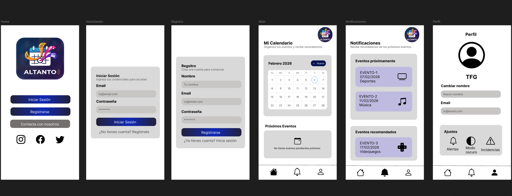

# TFG – Esports Calendar

Aplicación multiplataforma para gestionar eventos competitivos de videojuegos (esports) y recibir notificaciones antes de que comiencen.

---

## 1. Entorno y requisitos

- **Objetivo**: centralizar eventos competitivos y notificar al usuario.
- **Tecnologías**: Django + Django REST Framework (backend), React Native, Android Material 3 (móvil), PandaScore API (datos), Figma (prototipo).

---

## 2. Público objetivo

- Jóvenes de 18–30 años aficionados a esports (LoL, CS2, Valorant, etc.).
- Necesidades: filtrar eventos y recibir notificaciones antes de que empiecen.

---

## 3. Diseño

- **Paleta de colores**: tonos negros, grises y blancos; cada tipo de evento con color distinto.  
- **Figma**: [Prototipo](https://www.figma.com/design/ITsfrafGV7VT7wmIegFu5Y/Sin-t%C3%ADtulo?node-id=0-1&t=3bEpfzfTARzgS5hB-1)  
- **Tipografía**: sans-serif moderna / Roboto  
- **Material Design 3** con cards, FAB y Bottom Navigation  

**Pantallas principales**: Login / Registro, Calendario, Listado de eventos, Detalle de evento, Ajustes y Notificaciones

---

## 4. Historias de usuario

- **Registro**: `POST /api/auth/register`  
- **Login**: `POST /api/auth/login`  
- **Ver eventos**: `GET /api/events`  
- **Filtrar eventos**: `GET /api/events?game=lol&type=tournament`  
- **Notificaciones**: `POST /api/notifications/subscribe`  

---

## 5. Flujo de la app

1. Bienvenida → Registro/Login  
2. Calendario principal  
3. Selección de evento → Detalle  
4. Activar notificaciones (1 día / 1 hora antes)

---

## 6. Arquitectura

- **Cliente-servidor**, comunicación via API REST
- **Backend**: Django, persistencia de eventos, usuarios y notificaciones
- **Frontend**: React Native y Android (Activities, Fragments, RecyclerView, CalendarView)

---

## 7. Modelo Entidad–Relación

**Usuario** → **Notificación** ← **Evento**  
**Usuario** → **Preferencia**

Escalable y listo para Django ORM y consumo de API externa.
**Atributos clave**:
- Usuario: id, username, email, password  
- Evento: id, external_id, nombre, videojuego, tipo_evento, fecha_inicio/fin, color  
- Notificación: usuario_id, evento_id, tipo_notificacion, enviada  
- Preferencia: usuario_id, videojuego, color_asociado  
